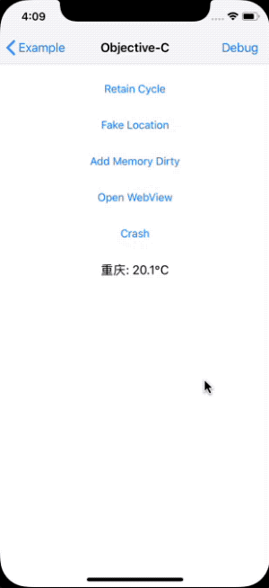

# FWDebug

# [中文](README_CN.md)

iOS debugging library, support for iOS9 +, without adding any code to facilitate iOS development and testing.

## Screenshot

## Tutorial
Real machine or simulator shaking within 5 seconds twice to appear debug menu. Functions are as follows:

* FLEX debugging tool (shaking to open)
* Circular reference detection and analysis (click to search on the object view page)
* View the header files of Class and Protocol (click "Runtime Headers" on the class view page)
* FPS, memory, CPU occupancy rate display (shaking to open)
* View mobile phone and App information ("Device Info" entrance)
* App crash log recording and viewing ("Crash Log" entrance)
* App file manager ("Browse Directory" entrance)
* Documents file http, webdav server ("Web Server" entrance)
* Real machine NSLog display ("System Log" entrance, "App Config" can be configured to filter system logs)
* Generate dylib dynamic library and inject other App ("Dylib" directory, mobile phone jailbreak required)
* App encryption tool ("App Config" can be configured to open)
* CLLocationManager virtual location ("Fake Location" entrance)
* Simulator virtual remote push sending and receiving function ("Fake Notification" entrance)
* APNs remote push sending function ("Fake Notification" entrance "APNS Client" configuration)
* View the startup time, controller loading and network request time ("Time Profiler" entry or click the frame rate icon to quickly view the current controller time)
* WKWebView request packet capture function (just check "Network History" after turning on the "App Config" switch)
* WKWebView automatically injects the vConsole function (just turn on WKWebView after turning on the "App Config" switch)
* WebSite static web server ("Web Server" entrance, the web file can be placed in Documents/website)

## Review
For everyone concerned about the issue of shelf audit, in particular, explain:

**Since this debug library calls the private APIs, the on-board review will not pass, so please remove it when submitting to AppStore.**

Just set `: configurations => ['Debug']` when adding a pod, valid only in Debug mode.

## Installation
CocoaPods installation is recommended for automatic management of dependencies and environment configuration. 

### CocoaPods
The debug library supports Debug and Release environment, it is recommended Debug mode is turned on. Podfile example:

	platform :ios, '9.0'
	# use_frameworks!

	target 'Example' do
	  pod 'FWDebug', :configurations => ['Debug']
	end

## Changelog
Version 1.9.2:

	* Added built-in static web server function

Version 1.9.1:

	* Refactor the project structure and introduce the tripartite library without modification
	* Sync Vendor latest trunk code
	* Optimize the NSLog log function of the filtering system

Version 1.9.0:

	* Added WKWebView request packet capture function
	* WKWebView automatically injects the vConsole debugging function

Version 1.8.5:

	* Updated FLEX to version 4.4.0

Version 1.8.4:

	* Updated FLEX to version 4.2.2

Version 1.8.3:

	* Added 5 finger double click to switch debugger function

Version 1.8.2:

	* Compatible with Xcode 12

Version 1.8.1:

	* Optimize the time view function, add clear button

Version 1.8.0:

	* Increase the launch time, controller loading and network request time viewing function
	* Add long press debug button to jump URL function
	* Optimized memory determination method

Version 1.7.4:

	* Updated FLEX to version 4.1.1
	* Minimum compatible with iOS9
	* Compatible with dark mode

Version 1.7.3:

	* Sync Vendor latest trunk code

Version 1.7.2:

	* Sync Vendor latest trunk code

Version 1.7.1:

	* Sync Vendor latest trunk code
	* Add a switch that can filter the System Log

Version 1.7.0:

	* Sync the latest trunk code such as FLEX 3
	* Compatible with Xcode 11

Version 1.6.0:

	* Added simulator virtual remote push send and receive function
	* Added APNs remote push sending function

1.5.3 version:

	* Sync Vendor latest trunk code

1.5.2 version:

	* Support InjectionIII

1.5.1 version:

	* Sync Vendor latest trunk code
	* Example project Swift 4 compatible

1.5.0 version:

	* Add CLLocationManager virtual positioning and movement

1.4.2 version:

	* Increase NSLog display limit
	* Example project Swift mixed debugging

1.4.1 version:

    * Optimized circular reference detection

1.4.0 version:

    * Add circular reference detection for classes and objects
    * Add circular reference detection for current ViewController

1.3.1 version:

	* Example project iPhoneX adaptation
	* Repair Documents file http server

1.3.0 version:

	* Remove some tools, keep the core functions
	* Reconstruction, optimization code
	* Add App Encryption Tool

1.2.1 version:

	* Sync FLEX latest trunk code
	* Add screenshots, update instructions

1.2.0 version:

	* Repair iOS10 real machine NSLog display
	* Add mobile app list to view
	* Add JSPatch dynamically modify the application
	* Add dylib projects and inject existing App tools

1.1.0 version:
	
	* Adjust the project structure
	* Update FLEX to 2.4.0 version
	* Add crash log debugging
	* Add Documents file http, webdav server
	* Add header files to view
	* Add FPS display
	* Add App, Device Information

1.0.0 version:

	* Add FLEX debugging

## Vendor
This debug library uses a third-party library, thanks to all third-party library authors. Listed below:
	
* [FLEX](https://github.com/Flipboard/FLEX)
* [GCDWebServer](https://github.com/swisspol/GCDWebServer)
* [RuntimeBrowser](https://github.com/nst/RuntimeBrowser)
* [KSCrash](https://github.com/kstenerud/KSCrash)
* [FBRetainCycleDetector](https://github.com/facebook/FBRetainCycleDetector)
* [NWPusher](https://github.com/noodlewerk/NWPusher)

## Support
[wuyong.site](http://www.wuyong.site)
