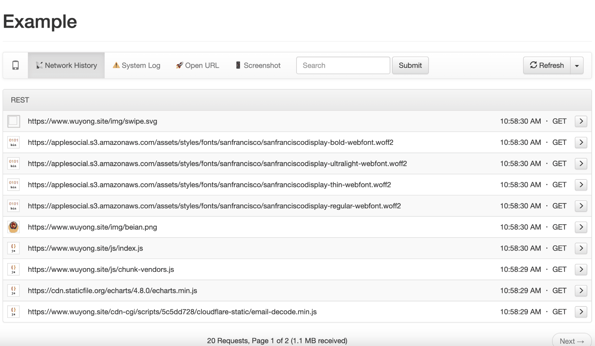

# FWDebug

# [English](README.md)

iOS调试库，支持iOS11+，无需添加任何代码，方便iOS开发和测试。

## 屏幕截图

### 手机端截图

### 浏览器截图

## 使用教程
真机或模拟器中5秒内摇一摇两次即可出现调试菜单。功能如下：

* FLEX调试工具（摇一摇开启）
* PC Web调试服务器功能，可查看手机网络请求、NSLog、打开URL、实时屏幕截图等（"Web Server"入口）
* 检查Swift对象功能（"App Config"默认开启）
* 视图距离测量功能（切换工具栏为"ruler"模式）
* 循环引用检测和分析（在对象查看页面点击搜索）
* Class和Protocol的头文件查看（在类查看页面点击"Runtime Headers"）
* FPS、内存、CPU占用率显示（摇一摇开启）
* 手机、App信息查看、模拟功能（"Device Info"入口）
* App崩溃日志的记录、查看（"Crash Log"入口）
* App崩溃日志上报邮箱和服务器（代码配置crashReporter）
* 文件日志的记录、查看（"Custom Log"入口）
* App文件管理器（"Browse Directory"入口）
* Documents文件http、webdav服务器（"Web Server"入口）
* 真机NSLog显示（"System Log"入口，"App Config"可配置过滤系统日志）
* 生成dylib动态库并注入其它App（"Dylib"目录，需手机越狱）
* App加密工具（"App Config"可配置开启）
* CLLocationManager虚拟定位（"Fake Location"入口）
* 模拟器虚拟远程推送发送和接收功能（"Fake Notification"入口）
* APNs远程推送发送功能（"Fake Notification"入口"APNS Client"配置）
* 启动时间、控制器加载和网络请求时间查看（"Time Profiler"入口或点击帧率图标快速查看当前控制器时间）
* WKWebView请求抓包功能（"App Config"打开开关后查看"Network History"即可）
* WKWebView自动注入vConsole功能（"App Config"打开开关后打开WKWebView即可）
* WebSite静态web服务器（"Web Server"入口，web文件放到Documents/website即可）
* WKWebView清理缓存功能（"App Config"入口）

## 审核说明
针对大家关心的上架审核问题，特别说明一下：

**由于本调试库调用了私有Api，上架审核会不通过的，所以提交AppStore时请移除。**

CocoaPods项目只需在添加pod时设置`:configurations => ['Debug']`，只在Debug模式生效即可。

Swift Package Manager项目可在打包AppStore时从所在Target中移除FWDebug即可。

## 安装教程
推荐使用CocoaPods或Swift Package Manager安装，自动管理依赖和环境配置。

### CocoaPods
本调试库支持Debug和Release环境，建议Debug模式开启。Podfile示例：

	platform :ios, '11.0'
	use_frameworks!

	target 'Example' do
	  pod 'FWDebug', :configurations => ['Debug']
	end

### Swift Package Manager
本调试库支持Swift Package Manager，注意打包AppStore时请从所在Target中移除FWDebug，Package示例：

    https://github.com/lszzy/FWDebug.git
    
    import FWDebug

## [更新日志](https://github.com/lszzy/FWDebug/blob/master/CHANGELOG_CN.md)

## 第三方库
本调试库使用了第三方库，在此感谢所有第三方库的作者。列举如下：

* [FLEX](https://github.com/Flipboard/FLEX)
* [GCDWebServer](https://github.com/swisspol/GCDWebServer)
* [RuntimeBrowser](https://github.com/nst/RuntimeBrowser)
* [KSCrash](https://github.com/kstenerud/KSCrash)
* [FBRetainCycleDetector](https://github.com/facebook/FBRetainCycleDetector)
* [NWPusher](https://github.com/noodlewerk/NWPusher)
* [swift-atomics](https://github.com/apple/swift-atomics)
* [Echo](https://github.com/Azoy/Echo)
* [Reflex](https://github.com/FLEXTool/Reflex)

## 官方网站
[大勇的网站](http://www.wuyong.site)
